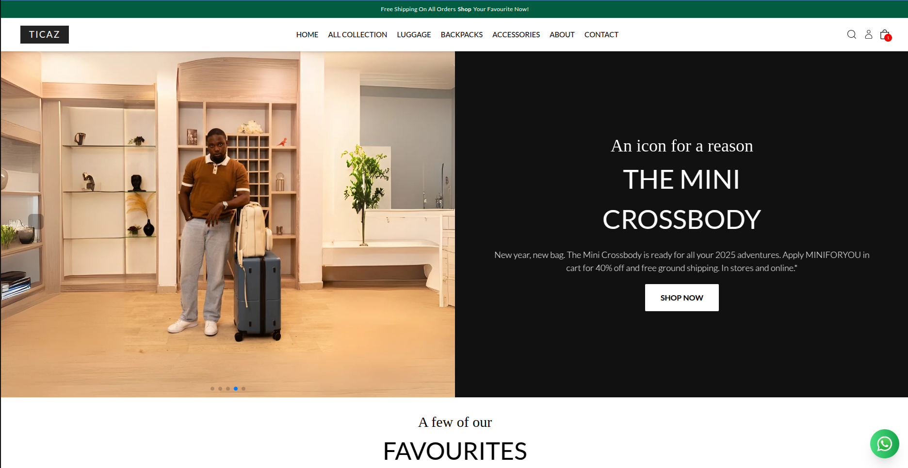

# 👜 Ticaz Bags & Luggage

**Ticaz Bags & Luggage** is a modern, responsive static e-commerce website where users can browse and shop for stylish bags and durable travel luggage. Built with **React**, **Vite**, and **Tailwind CSS**, the site is deployed to **AWS** using **Pulumi** for end-to-end infrastructure automation.

<!-- --- -->

## 🌐 Live Demo

Check out the live website:  [https://dyk9aqch11ytc.cloudfront.net/](https://dyk9aqch11ytc.cloudfront.net/)

<!-- --- -->

## 📁 Project Structure


/pulumi/www/frontend   → React + Vite + Tailwind frontend  
/pulumi     → Infrastructure as Code using Pulumi (AWS setup)


<!-- --- -->

## 🚀 Features

- 🧭 Clean and intuitive navigation
- 📱 Mobile-first responsive design
- ✨ Smooth scroll animations with AOS
- 🔔 Toast notifications with `react-hot-toast`
- 📦 Lazy image loading for performance
- 🛍️ Ready-to-integrate e-commerce layout

<!-- --- -->

## 🧑‍💻 Tech Stack

### Frontend

- [React](https://reactjs.org/)
- [Vite](https://vitejs.dev/)
- [Tailwind CSS](https://tailwindcss.com/)
- [React Router DOM](https://reactrouter.com/)
- [Arco Design](https://arco.design/) – UI library
- [AOS (Animate on Scroll)](https://michalsnik.github.io/aos/)
- [Styled Components](https://styled-components.com/)

### Infrastructure & Deployment

- [Pulumi](https://www.pulumi.com/) (TypeScript)
- [AWS S3](https://aws.amazon.com/s3/) – Static site hosting
- [AWS CloudFront](https://aws.amazon.com/cloudfront/) – CDN for performance
- [AWS IAM](https://aws.amazon.com/iam/) – Access control

<!-- --- -->

##  Getting Started

### 1. Clone the Repository

```bash
git clone https://github.com/iAmSherifCodes/TicazOnAWSPulumi.git
cd TicazOnAWSPulumi
```

### 2. Install Dependencies

```bash
cd frontend
npm install
```

### 3. Start the Development Server

```bash
npm run dev
```

---

## ⚙️ Deploying with Pulumi

### Prerequisites

- [Node.js](https://nodejs.org/)
- [Pulumi CLI](https://www.pulumi.com/docs/install/)
- [AWS CLI](https://docs.aws.amazon.com/cli/latest/userguide/cli-chap-install.html) (configured with credentials)

### Initial Setup

```bash
cd pulumi
pulumi login
pulumi stack init dev
pulumi config set aws:region us-east-1
```

### Deploy to AWS

```bash
# Build the frontend
cd ../frontend
npm run build

# Deploy with Pulumi
cd ../pulumi
pulumi up
```

### Updating the Deployment

When changes are made:

```bash
cd frontend
npm run build

cd ../pulumi
pulumi up
```

---

## 📸 Screenshots



<!-- --- -->

### Clean up

To cleanly destroy the stack and all of its infrastructure on Pulumi

```bash
pulumi destroy
```

## 🙌 Credits

Built with ❤️ for the   [Pulumi Deploy and Document Challenge](https://dev.to/challenges/pulumi)

